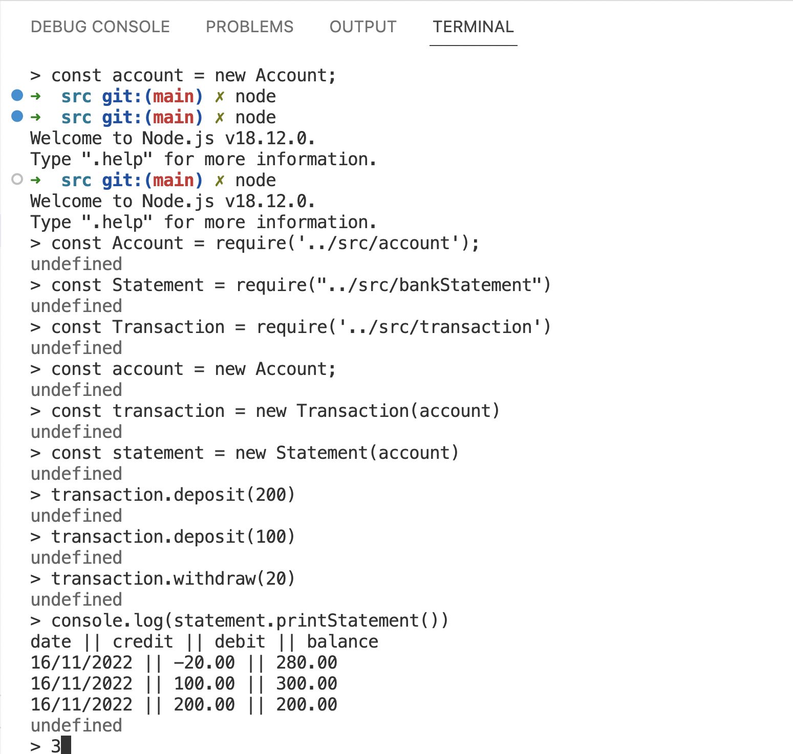
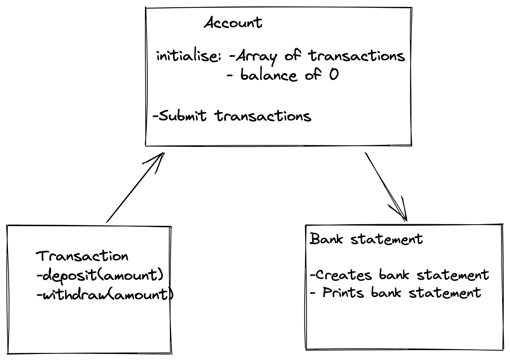

# Bank tech test

## The Application

The Bank application represents a bank account where the user can withdraw and deposit money. It is to be used within the terminal. 

The Account object acts as the interface for the application. It keeps track of all transactions and the user is able to print their current bank statement.  

### To run

- Clone this repository git clone https://github.com/hibscodes/BankTech_test .
- Open node in the terminal.
- Install dependancies `npm install`.
- Run tests via `jest`
- Create an account const account = new Account;;.
- Create a transaction, transaction = new Transaction(account):  
  `transaction.deposit(20);`  
  `transaction.withdraw(5);`
- Get your current account bank statement printed to the console using transaction.printStatement().

### Demo


## Specification

### Requirements

- You should be able to interact with your code via a REPL like IRB or Node. (You don't need to implement a command line interface that takes input from STDIN.)
- Deposits, withdrawal.
- Account statement (date, amount, balance) printing.
- Data can be kept in memory (it doesn't need to be stored to a database or anything).

### Acceptance criteria

**Given** a client makes a deposit of 1000 on 10-01-2023  
**And** a deposit of 2000 on 13-01-2023  
**And** a withdrawal of 500 on 14-01-2023  
**When** she prints her bank statement  
**Then** she would see

```
date || credit || debit || balance
14/01/2023 || || 500.00 || 2500.00
13/01/2023 || 2000.00 || || 3000.00
10/01/2023 || 1000.00 || || 1000.00
```

## Design

### Diagram of the class systems

